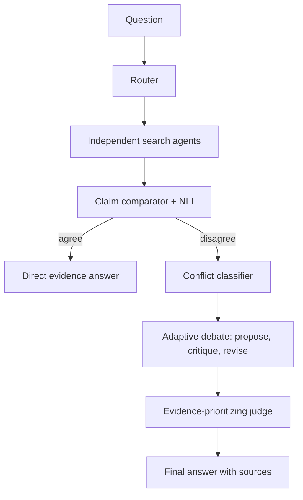

# Evidence-MAD

A research prototype for **evidence-triggered, conflict-type-aware multi-agent debate**.
It retrieves evidence independently, compares claims with NLI, and only runs
Propose -> Critique -> Revise when the contradiction score crosses the configured gate.

## Run

```bash
python -m pip install -r requirements.txt
cp .env.example .env
python app.py --demo
python -m evaluation.run_experiments --demo
python api.py
```

Demo mode is offline and intentionally contains both paths: ordinary questions
produce agreeing evidence and skip debate; policy-introduction questions produce
a temporal conflict and run three debate rounds. Real mode uses the configured OpenAI-compatible LLM endpoint and independent,
keyless search providers. Agent A uses DuckDuckGo HTML search, Agent B uses the
Wikipedia public API, and Agent C uses Crossref scholarly metadata. Crossref and
Wikipedia have DuckDuckGo fallbacks so the prototype can continue when a free
endpoint rate-limits or is unavailable. Google Custom Search remains an optional
provider when `SEARCH_API_KEY` and `SEARCH_ENGINE_ID` are configured. The NLI
model is configurable; use `NLI_MODE=mock` for a fast local run or
`NLI_MODE=transformers` for the Hugging Face model.

## Architecture



Conflict strategies are factual, temporal, version, contextual, and source-specific.
Each execution is saved as a JSON trace under `results/`, including evidence,
claim-pair scores, gate decision, strategy, rounds, latency, and call count.

## Independent search agents

The agents intentionally do not all send the same request to the same search
engine:

| Agent | Provider | Query focus |
|---|---|---|
| `search_agent_a` | DuckDuckGo HTML | General web sources |
| `search_agent_b` | Wikipedia public API, then DuckDuckGo fallback | Reference and primary-background sources |
| `search_agent_c` | Crossref scholarly API, then DuckDuckGo academic fallback | Academic and historical sources |

The provider and query suffix are preserved in each evidence record metadata,
so an experiment can inspect how the evidence was obtained. No search API key is
required for the default providers. These sources can still overlap when they
index the same fact, but the retrieval paths and returned URLs are independent.

To test the providers directly:

```bash
python -c "import asyncio; from agents.search_agent import SearchAgentA, SearchAgentB, SearchAgentC; agents=[SearchAgentA(False), SearchAgentB(False), SearchAgentC(False)]; print([(a.agent_id, a.config.provider) for a in agents]); asyncio.run(asyncio.gather(*(a.close() for a in agents)))"
```

## Evaluation

`data/conflicts.json` is a small starter dataset. The runner executes Single LLM,
Standard MAD, and Proposed MAD, computes measured metrics, saves CSV/JSON outputs,
and writes matplotlib figures to `results/figures/`. Results are not hard-coded;
real accuracy depends on the selected dataset and available services.

## Limitations

The demo search corpus is synthetic, snippets are not full page retrieval, and
heuristic fallback classification is less reliable than the configured LLM/NLI
models. A larger human-labelled benchmark and source-quality annotation are
needed for publication-grade claims.

## Web frontend and Vercel deployment

The repository now includes a no-build browser frontend in `frontend/index.html`.
It calls `/api/solve`, while `api/index.py` exposes the FastAPI application as a
Vercel Python function. The `vercel.json` routes the frontend and API together.

Test locally:

```bash
# terminal 1
uvicorn api:app --reload --port 8000
# terminal 2: open http://localhost:8000/docs for the API,
# or serve frontend/index.html with: python -m http.server 3000 --directory frontend
```

Deploy to Vercel:

```bash
npm install --global vercel
vercel login
cd /home/ssp/mad/evidence-mad
vercel link
vercel env add LLM_API_KEY production
vercel env add LLM_BASE_URL production       # https://generativelanguage.googleapis.com/v1beta/openai/
vercel env add LLM_MODEL production          # gemini-3.8-flash
vercel env add DEMO_MODE production          # false for real mode, true for demo mode
vercel --prod
```

Do not upload `.env`; it is excluded by `.vercelignore`. For a first deployment,
use `DEMO_MODE=true` to validate the UI without external credentials, then add a
valid production Gemini key through Vercel Environment Variables.

# MAD
